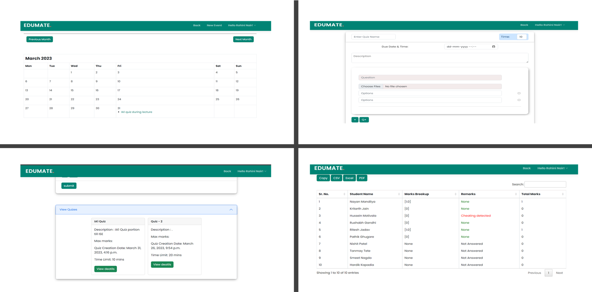
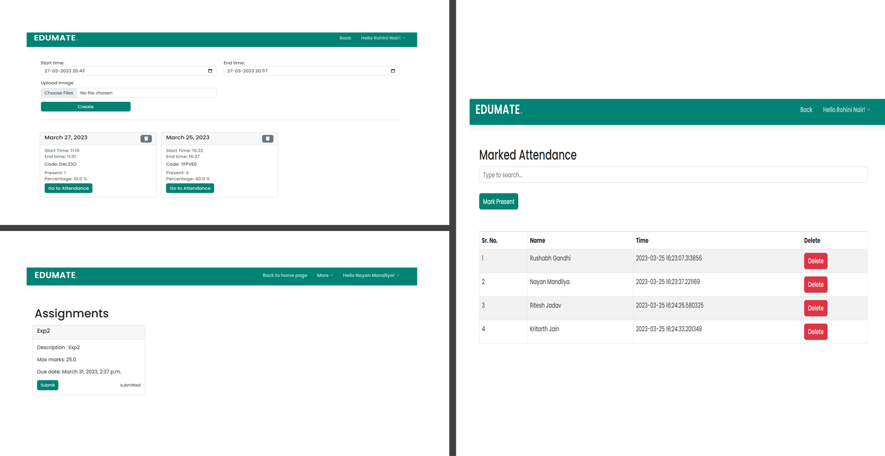
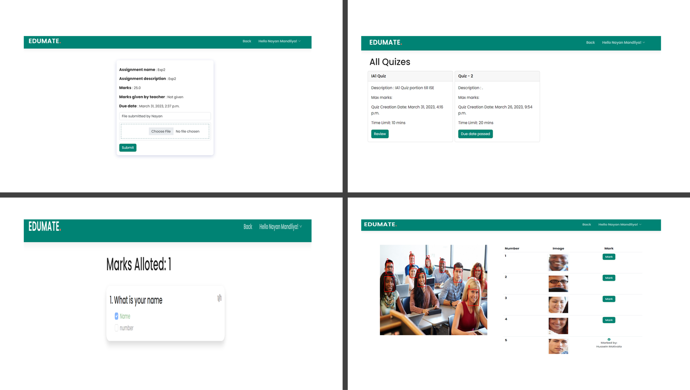
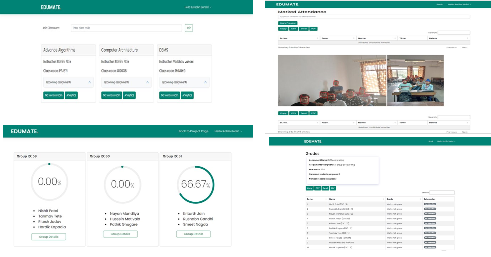
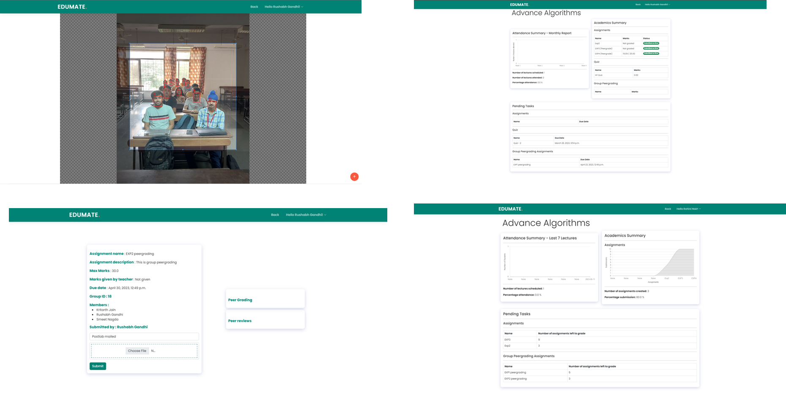

<p align="center">
  
</p>
<br>


<hr>
<h1 align="center">Edumate</h1>


<p align="center">
  <em>
    Edumate is an innovative education institution management system designed to simplify and streamline administrative and academic tasks for teachers and students. It is a flexible, generic system that can be easily integrated with any existing system with minor modifications. Developed to reduce the workload of teachers and provide students with a seamless digital experience, Edumate can help educational institutions store data, maintain student profiles, analyze administrative and academic data, improve communication, and engage students.
  </em> 

</p>

<br><br>
 

&nbsp;***TECH-STACK***
<p align="left">
   
  <code></code>
  <code>  </code>
  <code></code>
  <code>  </code>
  <code>  </code>
  <code>  </code>
  <code>  </code>
  <code>  </code>
  <code>  </code>
  <code>  </code>
  <code>  </code>
  <code>  </code>
  
  

  <hr>
  </p>
  
 ---
 
 ### Team Members
 #### 1. Rushabh Gandhi: 1911012
 #### 2. Kritarth Jain: 1911020
 #### 3. Nayan Mandliya: 1911027
 #### 4. Hussein Motiwala: 1911031
 
---
 
 ### Instructions to run
 * Install virtual environment using the following command
 ```
 pip install virtualenv
```
* Create new virtual environment
```
python -m venv <name_of_your_environment>
```
* Activate your virtual environment
```
<name_of_your_environment>\Scripts\activate.bat
```
* Install project dependencies
```
pip install -r requirements.txt
```
* Make migrations 
```
python manage.py makemigrations
python manage.py migrate
```
* Run the server inside project folder and go to the url that appears on your command prompt
```
python manage.py runserver
```
 
---
<h2 align="center">
Snapshots of the project
</h2>
  

  
 
 
  

---
### Research Paper Details
A research paper has been published for the smart attendence module. 
Here is the link to the research paper: <a href="https://journal.ijresm.com/index.php/ijresm/article/view/2694" target="_blank">Effective Inexpensive and Robust Solution to Classroom Attendance Recording Using Face Detection Technology</a>

---

### Features of Edumate
* User authentication: Secure login and access control for teachers and students
* Virtual classrooms: Create and manage virtual classrooms for courses and subjects
* Assignments: Create, assign, and submit tasks and projects
* Grading and feedback: Efficiently grade and provide feedback on assignments and projects
* Class announcements: Post important announcements and updates for the class
* Scheduling: Create and share schedules with students
* Quizzes: Create, administer, and take quizzes to assess student knowledge and understanding
* Peer assessment: Allow students to provide feedback on each other's work
* Attendance tracking: Record and manage attendance automatically
* Group work: Allow students to work collaboratively and provide feedback on group projects
* Plagiarism detection: Check student work for plagiarism to ensure academic integrity
* Analytics and reporting: Analyze and visualize academic data to gain insights
* Administration: Manage and administer the system efficiently
* Quiz security: Detect and prevent cheating during quizzes
---
###User guide demo video


https://github.com/hussein-hub/Edumate/assets/56965843/861a0304-3fd7-4887-88c8-ecf266576241


---
<h3 align="center"><b>Developed with :heart: by <a href="https://github.com/rushabhgandhi13">Rushabh Gandhi</a>, <a href="https://github.com/krucx">Kritarth Jain</a>, <a href="https://github.com/nixen2802">Nayan Mandliya</a>, <a href="https://github.com/hussein-hub/">Hussein Motiwala</a>.</b></h1>
